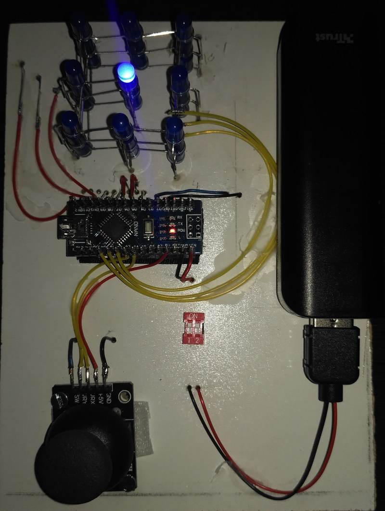
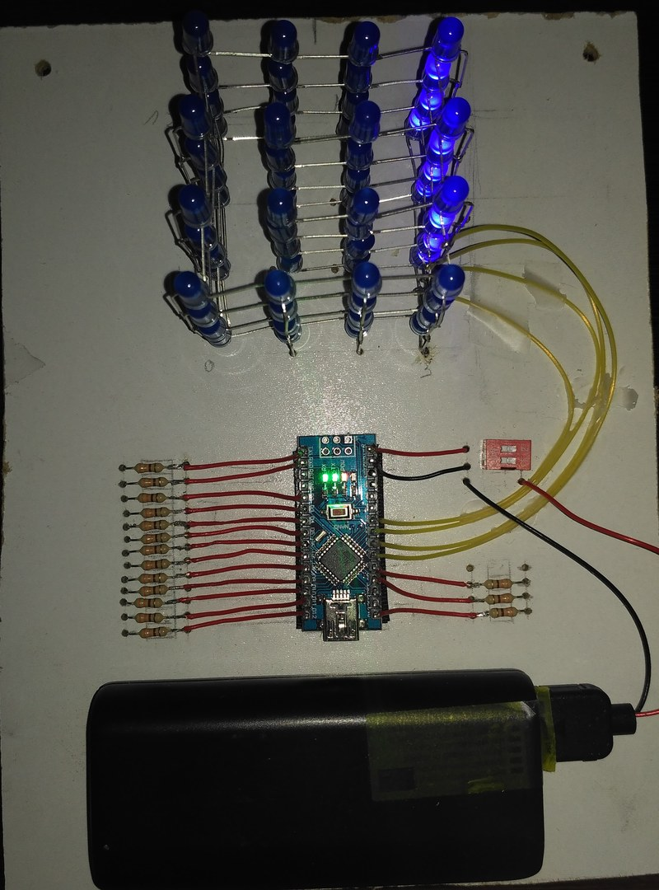

# Arduino Nano LED Cube project

Software project for Arduino Nano to control 3D LED cubes.

## Features
- Configurable cube size. Right now works for LED cubes 3x3x3 and 4x4x4 configurations
- Configurable between pattern/marquee leds and interactive game
- Interactive Simon game through joystick

### Hardware components used for Led Cube

- Arduino [Nano](https://store.arduino.cc/arduino-nano) or compatible
- Blue 5 mm LED diodes. 64 leds for 4x4x4 cubes and 27 leds for 3x3x3 cubes
- Resistors 330 ohms. 16 resistors for 4x4x4 cubes and 9 resistors for 3x3x3 cubes
- Battery or powerbank [ 5V,  +2200 mAh ]
- Optional joystick analog 2-Axis with button for interactive games
- Optional dip switch to turn on/off the cube
- Cube structure, up to your imagination. I followed instructions from [here](https://tutorial.cytron.io/2015/08/17/4x4x4-led-cube-using-arduino-uno-without-extra-ic/)

### Software structure

The software is splitted into [Abstraction Layers](https://en.wikipedia.org/wiki/Abstraction_layer) so the responsability of each layer are very limited and will make easier the growth and maintenance of the project in a Architectural point of view. Using a objected-oriented language such as C++ accepted by Arduino, makes the implementation closer to this approach.

**Dependencies**: Needs to have access to _Generic-Libraries/lib_ from this same repository
```
ArduinoNano-LED-Cube
|--lib
|  |--LC_Game
|  |  |- CLedGame.cpp
|  |  |- CLedGame.h
|  |--LC_Marquee
|  |  |- CLedMarquee.cpp
|  |  |- CLedMarquee.h
|  |--LCLib_Leds
|  |  |- CLeds.cpp
|  |  |- CLeds.h
|--src
|  |- main.cpp
|  |- main.h
|- platformio.ini
Generic-Libraries
|--lib
|  |--Joystick_Lib
|  |--Common_Lib
|--external-libs
|  |--LowerPower
```

### **TODO**: electrical schematics

### Led cube 3x3x3 with joystick for Simon game


### Led cube 4x4x4

